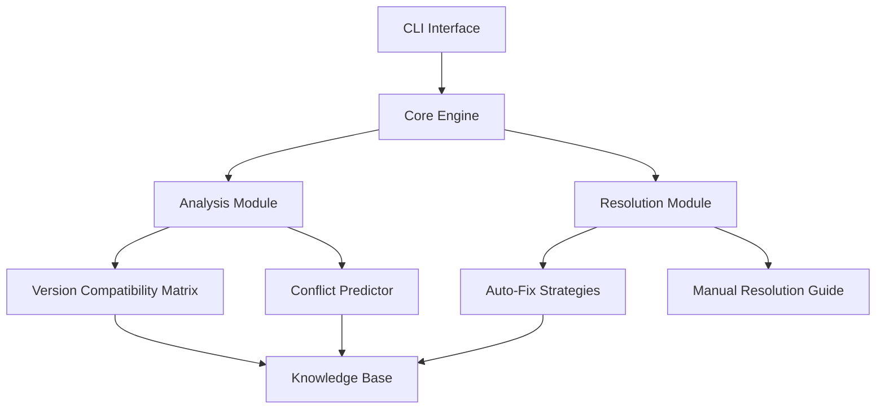

## 🧩 Architecture Overview



## ⚙️ Installation

### Quick Start (Linux/macOS)
```bash
curl -sSL https://install.mechmind.ai | bash
```

### Python Package
```bash
pip install mechmind-ai
```

### Docker Image
```bash
docker pull mechmind/ai-dependency:v3
```
